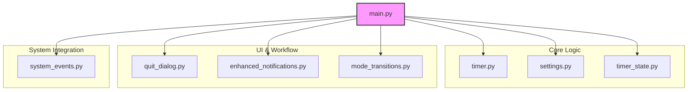

# System Architecture: Sharp Timer

## Architectural Vision
Sharp Timer is built on a modular, single-process architecture designed for simplicity, performance, and maintainability. It runs as a macOS menu bar application, leveraging the `rumps` framework for its core lifecycle and UI management. The architecture emphasizes a clear separation of concerns, ensuring that components like the timer engine, state management, and user notifications are independent and can be tested in isolation.

## Component Breakdown

The application is structured into several key Python modules located under the `sharp_timer/` directory.

### Key Modules

- **`main.py`**: The application's entry point. It initializes all components, manages the `rumps` application lifecycle, and orchestrates the interactions between different modules.

- **`timer.py`**: The core timer engine. It runs in a separate thread to keep the UI responsive and handles the countdown logic.

- **`settings.py`**: Manages user preferences and application configuration. It handles loading and saving settings from a JSON file.

- **`timer_state.py`**: A critical component for persistence. It defines the `TimerState` data class and includes the `TimerStateManager` which handles saving, loading, and backing up the timer's state. This enables session recovery after restarts or crashes.

- **`quit_dialog.py`**: Implements the user-facing confirmation dialog that appears when a user tries to quit while a timer is active.

- **`enhanced_notifications.py`**: Manages the 5-second audio alerts, including fallback mechanisms to ensure the user is notified.

- **`mode_transitions.py`**: Contains the logic for automatically switching between timer modes (e.g., from "Work" to "Rest Your Eyes").

- **`system_events.py`**: Handles integration with the macOS operating system, specifically for detecting sleep and wake events to preserve the timer's state.

## Design Patterns & Principles

- **Separation of Concerns**: Each module has a distinct responsibility. For example, `timer.py` only knows how to count down, while `mode_transitions.py` handles the workflow logic.
- **State Management**: The application's state, particularly the active timer's progress, is managed explicitly through the `TimerState` object. This state is persisted to disk to ensure reliability.
- **Event-Driven**: The core application loop is event-driven, managed by `rumps`. Timer completions and user interactions trigger specific methods, promoting a reactive and efficient design.
- **Thread Safety**: The timer runs in a background thread (`threading.Timer`) to avoid blocking the main UI thread, ensuring the menu bar remains responsive at all times.

## Data Persistence

- **Storage Format**: Data is stored in JSON format for human readability and ease of debugging.
- **Location**: All user-specific data is stored in `~/Library/Application Support/Sharp Timer/`, following macOS conventions.
- **Atomic Operations**: To prevent data corruption, settings and timer state are written to a temporary file before being atomically moved to their final destination. This ensures that even if the application is interrupted during a write, the original file remains intact.
