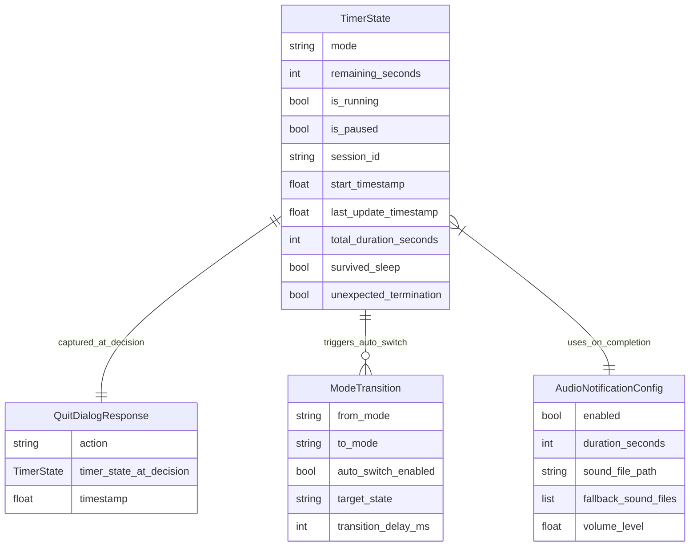

# Data Model: Sharp Timer Enhancements

**Date**: 2025-11-14  
**Feature**: 002-enhancements  
**Version**: 1.0

## Entity Overview

This document defines the data model for the enhanced Sharp Timer application, focusing on timer state persistence, quit confirmation workflow, and automatic mode switching.

## Core Entities

### 1. TimerState

Represents the complete state of a timer session that can be persisted and restored.

```python
@dataclass
class TimerState:
    """Complete timer state for persistence and recovery."""
    
    # Core timer properties
    mode: str                    # 'work', 'rest_eyes', 'long_rest'
    remaining_seconds: int       # Time remaining in current session
    is_running: bool            # True if timer is currently running
    is_paused: bool             # True if timer is paused
    
    # Session metadata
    session_id: str             # UUID for session tracking
    start_timestamp: float      # Unix timestamp when session started
    last_update_timestamp: float # Unix timestamp of last state update
    
    # Duration configuration (snapshot at session start)
    total_duration_seconds: int # Total duration for this session
    
    # System state tracking
    survived_sleep: bool        # True if session survived system sleep
    unexpected_termination: bool # True if recovery after crash
```

**Validation Rules**:
- `mode` must be one of: 'work', 'rest_eyes', 'long_rest'
- `remaining_seconds` must be >= 0 and <= `total_duration_seconds`
- `is_running` and `is_paused` cannot both be True
- `session_id` must be a valid UUID string
- Timestamps must be valid Unix timestamps

**State Transitions**:
```
INIT → STARTED → RUNNING → PAUSED → COMPLETED
  ↓        ↓         ↓        ↓        ↓
RESET   RESUME   PAUSE   RESUME   AUTO_SWITCH
```

### 2. QuitDialogResponse

Represents user choice in the quit confirmation dialog.

```python
@dataclass
class QuitDialogResponse:
    """User response to quit confirmation dialog."""
    
    action: str                 # 'stop_and_quit', 'preserve_and_quit', 'cancel'
    timer_state_at_decision: TimerState  # State snapshot when dialog shown
    timestamp: float            # When decision was made
```

**Action Values**:
- `stop_and_quit`: Stop timer and quit application
- `preserve_and_quit`: Quit but preserve timer state for next launch
- `cancel`: Cancel quit operation and continue running

### 3. ModeTransition

Represents automatic mode switching behavior.

```python
@dataclass
class ModeTransition:
    """Configuration for automatic mode switching."""
    
    from_mode: str              # Source mode ('work', 'rest_eyes', 'long_rest')
    to_mode: str                # Target mode ('work', 'rest_eyes', 'long_rest')
    auto_switch_enabled: bool   # Whether auto-switch is enabled
    target_state: str           # 'paused' or 'running' after switch
    transition_delay_ms: int    # Delay before switching (default: 100ms)
```

**Predefined Transitions**:
- Work → Rest Your Eyes (paused)
- Rest Your Eyes → Work (paused)
- Long Rest → Work (paused)

### 4. AudioNotificationConfig

Configuration for enhanced audio notifications.

```python
@dataclass
class AudioNotificationConfig:
    """Configuration for audio notification system."""
    
    enabled: bool               # Whether audio notifications are enabled
    duration_seconds: int       # Duration to play sound (default: 5)
    sound_file_path: str        # Path to primary sound file
    fallback_sound_files: List[str]  # List of fallback sound files
    volume_level: float         # Volume level (0.0 to 1.0)
```

**Default Configuration**:
```python
DEFAULT_AUDIO_CONFIG = AudioNotificationConfig(
    enabled=True,
    duration_seconds=5,
    sound_file_path='/System/Library/Sounds/Glass.aiff',
    fallback_sound_files=[
        '/System/Library/Sounds/Ping.aiff',
        '/System/Library/Sounds/Purr.aiff'
    ],
    volume_level=1.0
)
```

## Enhanced Settings Schema

The existing settings.json will be extended with new sections:

```json
{
  "work_duration": 25,
  "rest_eyes_duration": 5,
  "long_rest_duration": 15,
  "current_mode": "work",
  "notifications_enabled": true,
  "sound_enabled": true,
  "auto_start_next": false,
  
  "timer_state": {
    "mode": "work",
    "remaining_seconds": 1500,
    "is_running": true,
    "is_paused": false,
    "session_id": "550e8400-e29b-41d4-a716-446655440000",
    "start_timestamp": 1699999999.0,
    "last_update_timestamp": 1700000000.0,
    "total_duration_seconds": 1500,
    "survived_sleep": false,
    "unexpected_termination": false
  },
  
  "mode_transitions": {
    "work_to_rest_eyes": {
      "enabled": true,
      "target_state": "paused",
      "transition_delay_ms": 100
    },
    "rest_eyes_to_work": {
      "enabled": true,
      "target_state": "paused",
      "transition_delay_ms": 100
    },
    "long_rest_to_work": {
      "enabled": true,
      "target_state": "paused",
      "transition_delay_ms": 100
    }
  },
  
  "audio_config": {
    "enabled": true,
    "duration_seconds": 5,
    "sound_file_path": "/System/Library/Sounds/Glass.aiff",
    "fallback_sound_files": [
      "/System/Library/Sounds/Ping.aiff",
      "/System/Library/Sounds/Purr.aiff"
    ],
    "volume_level": 1.0
  },
  
  "system_integration": {
    "handle_sleep_events": true,
    "preserve_state_across_restarts": true,
    "quit_confirmation_enabled": true
  }
}
```

## Data Relationships



## Persistence Strategy

### File Structure
```
~/Library/Application Support/Sharp Timer/
├── settings.json              # Main configuration and current state
├── timer_state_backup.json    # Backup of timer state (updated every 30s)
└── crash_recovery.json        # State for crash recovery (temporary)
```

### Atomic Operations
1. **Timer State Updates**: Write to temporary file, then atomic move
2. **Backup Creation**: Every 30 seconds during active timer
3. **Crash Recovery**: Create recovery file on start, remove on clean exit

### Data Integrity
- JSON schema validation on load
- Fallback to defaults on corruption
- Automatic backup restoration
- Checksum validation for critical state

## API Contracts

### Timer State Management

```python
class TimerStateManager:
    def save_timer_state(self, state: TimerState) -> bool
    def load_timer_state(self) -> Optional[TimerState]
    def create_backup(self, state: TimerState) -> bool
    def restore_from_backup(self) -> Optional[TimerState]
    def clear_timer_state(self) -> bool
    def validate_timer_state(self, state: TimerState) -> bool
```

### Mode Transition Management

```python
class ModeTransitionManager:
    def get_transition_config(self, from_mode: str, to_mode: str) -> ModeTransition
    def execute_auto_switch(self, current_state: TimerState) -> TimerState
    def is_auto_switch_enabled(self, from_mode: str) -> bool
    def set_transition_config(self, transition: ModeTransition) -> bool
```

### Quit Dialog Management

```python
class QuitDialogManager:
    def show_quit_confirmation(self, timer_state: TimerState) -> QuitDialogResponse
    def execute_quit_action(self, response: QuitDialogResponse) -> bool
    def should_preserve_timer_state(self, response: QuitDialogResponse) -> bool
```

## Migration Strategy

### From Current Settings
1. Load existing settings.json
2. Add new sections with default values
3. Migrate current_mode to timer_state.mode if no active timer
4. Preserve all existing user preferences

### Version Compatibility
- Settings version tracking for future migrations
- Backward compatibility for missing sections
- Graceful degradation for unknown configuration

## Testing Data Model

### Test Fixtures
```python
# Sample timer state for testing
SAMPLE_TIMER_STATE = TimerState(
    mode="work",
    remaining_seconds=1500,
    is_running=True,
    is_paused=False,
    session_id="test-session-uuid",
    start_timestamp=1699999999.0,
    last_update_timestamp=1700000000.0,
    total_duration_seconds=1500,
    survived_sleep=False,
    unexpected_termination=False
)

# Sample quit dialog response
SAMPLE_QUIT_RESPONSE = QuitDialogResponse(
    action="preserve_and_quit",
    timer_state_at_decision=SAMPLE_TIMER_STATE,
    timestamp=1700000001.0
)
```

### Validation Tests
- Timer state validation with edge cases
- Settings schema validation
- Migration testing from old format
- Corruption recovery testing
- Performance testing for persistence operations
